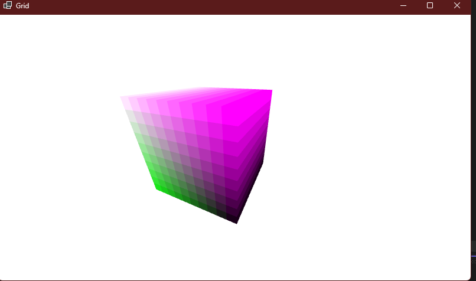

<h1>Работа с геометрией</h1>

Был создан куб из ячеек, у каждой ячейки есть свойство - float значение.

Хоть ячейки есть и внутри, и снаружи, алгоритм отрисовки работает таким образом, что пиксельный шейдер вызывается только для внешних ячеек.

