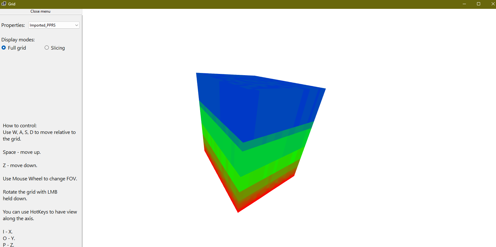
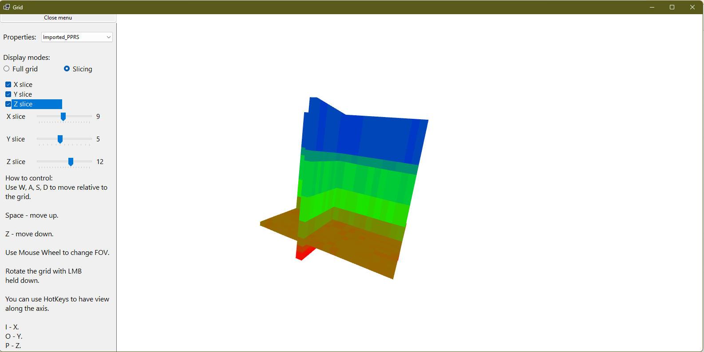
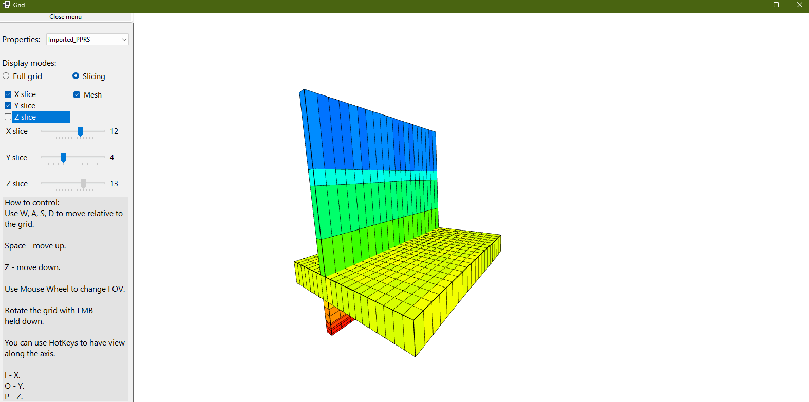
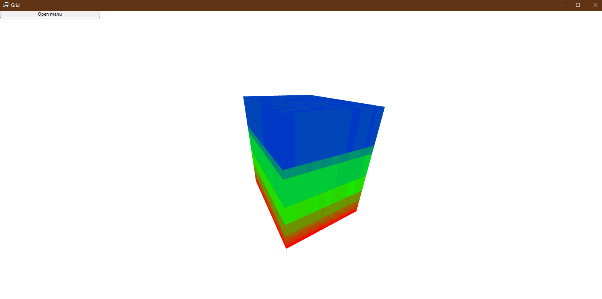
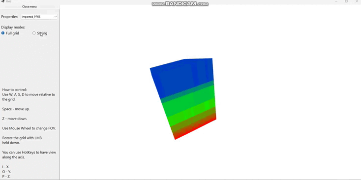
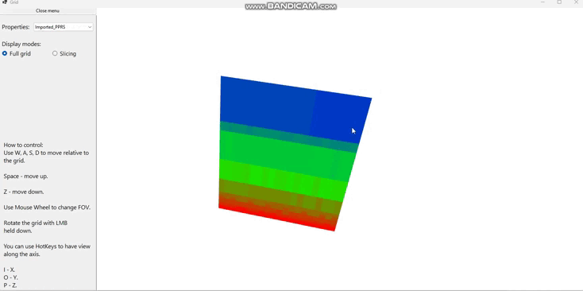
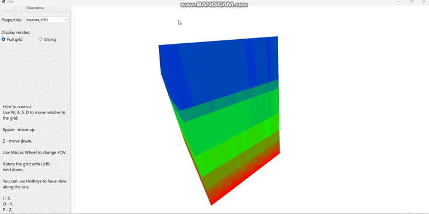

<h1>Визуализация грида</h1>

В данной задаче был визуализирован грид из файла.

Грид полностью заполнен ячейками со значениями, однако отображаются только внешние слайсы, чтобы оптимизировать программу.

Также добавлена возможность для расширения в следующую задачу "Слайсинг".

<h1>Слайсинг</h1>

В данном пункте был добавлен слайсинг, когда, с помощью интерфейса, пользователь переключиться в решим слайсинга, на экране появиться CheckBoxList и 3 ползунка, с помощью которых можно управлять слайсами.

<h1>Возможность включить отображение сетки:</h1>

<h2>Интерфейс</h2>

Интерфейс выполнен с помощью панели, которую при желании можно спрятать с помощью кнопки, и вернуть, с помощью той же кнопки.

<h3>Пример 1:</h3>

<h2>Управление:</h2>
Управление реализуется с помощью мыши и клавиатуры.
С помощью клавиатуры можно перемещаться вверх-вниз-влево-вправо-вперед-назад.
С помощью мыши можно вращать грид и масштабировать его на колёсико мыши.
<h3>Пример 1:</h3>

Также реализованы бинды (пока клавишами I O P), с помощью которых можно перемещаться на вид на определенную сторону.

<h3>Пример 2:</h3>

<h3>Стек:</h3>

    ⇒ C# 7.3, .NET Framework 4.8
    ⇒ Windows Forms
    ⇒ SharpDX 4.2.0, SharpDX.Direct3D11 4.2.0

