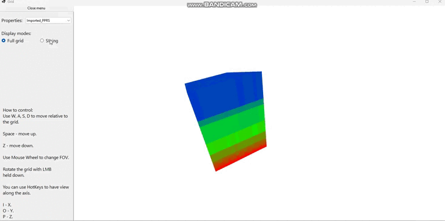

# InternshipPetroGM-3D

## About project

This repository consists solution for rendering 3D objects using OpenGL and DirectX.

### Project objective

To learn the different graphics APIs, common practices of rendering 3D objects, lighting, textures, shaders usage.

### Author

[draksal1](https://github.com/draksal1)

### Reviewer

[Arkadiy Khorunzhenko](https://github.com/SkivHisink)

## OpenTKTasksStack

This solution creates the application for rendering 3D objects based on the following stack:

- ⇒ С# 12.0, .NET 8.0
- ⇒ ImGui.Net 1.90
- ⇒ OpenTK 4.8.2, OpenGL 4.6

## SharpDXTasksStack

This solution creates the application for rendering 3D objects based on the following stack:

- ⇒ C# 7.3, .NET Framework 4.8
- ⇒ Windows Forms
- ⇒ SharpDX 4.2.0, SharpDX.Direct3D11 4.2.0

## Main task is the Grid Visualization

