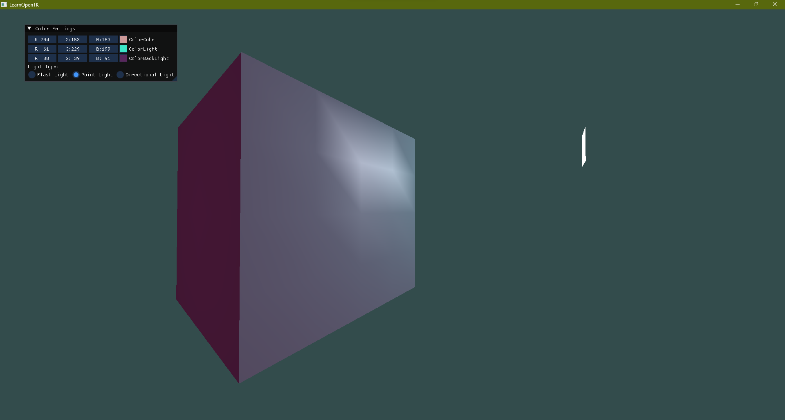
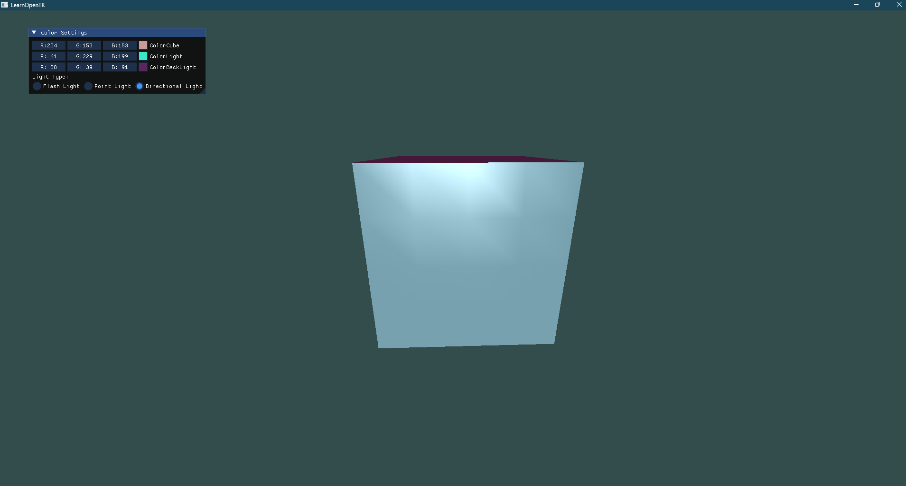
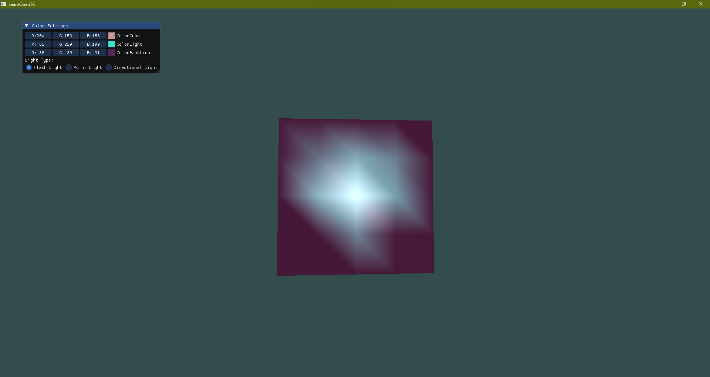
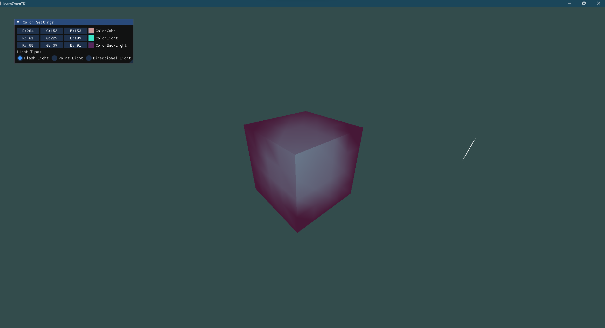

<h1>Lab 2</h1>

Реализовано освещение объекта (кораллового куба). Реализована модель полного отражения Фонга в вершинном шейдере.

Также реализовано 3 типа освещения: Направленный свет, точечный источник света и фонарик.

<h2>Точечный источник света:</h2>

<h2>Направленный свет</h2>

Направление только по оси Z:

Направление (-0.1, 0.3, -1.0):

png.png)

<h2>Фонарик:</h2>

