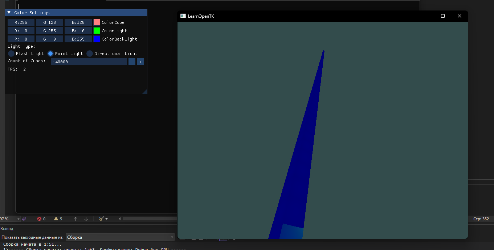
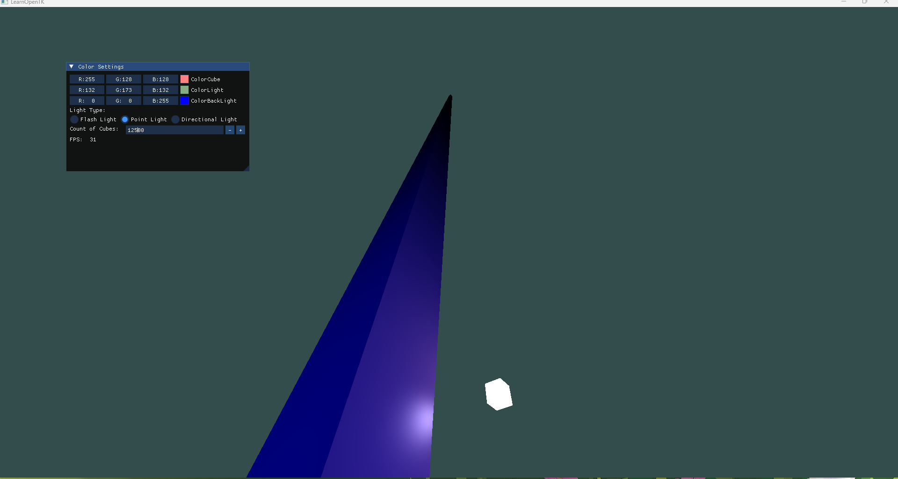
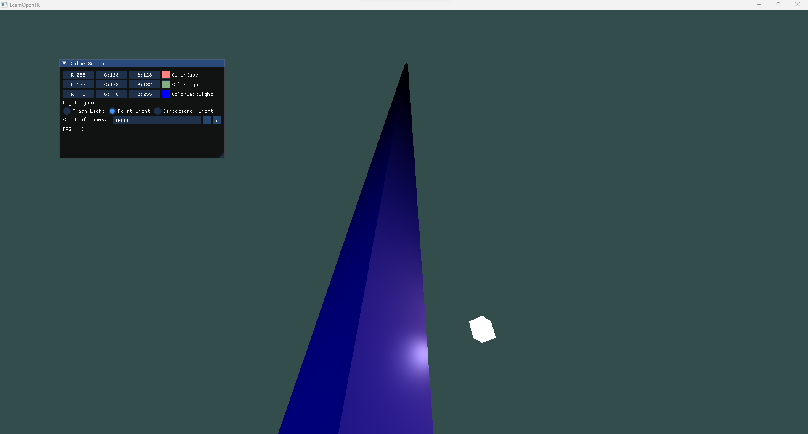

<h1>Lab3</h1>

<h2>Описание:</h2>
Взято за основу задание 4, так как фрагментные шейдеры сильнее нагружают систему и понадобиться меньше объектов для уменьшения частоты кадров.

Добавлено отображение кадров через интерфейс Dear ImGui.NET.

Добавлена возможность в момент исполнения программы добавлять объекты.

<h2>Пример:</h2>

В данном примере видно, что до скорость рендеринга уменьшается до 2 FPS примерно на 140.000 объектах.

<h2>Скриншоты разных FPS</h2>

<h3>55 FPS</h3>

<h3>33 FPS</h3>

<h3>6 FPS</h3>

