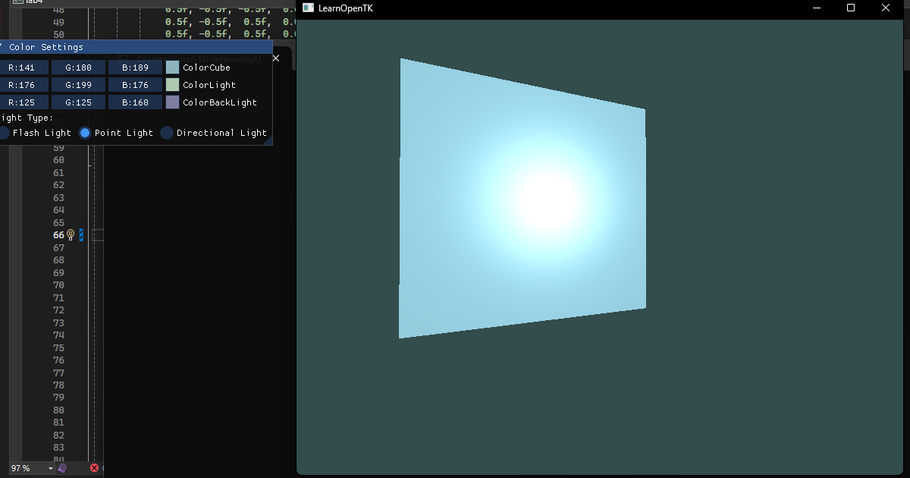
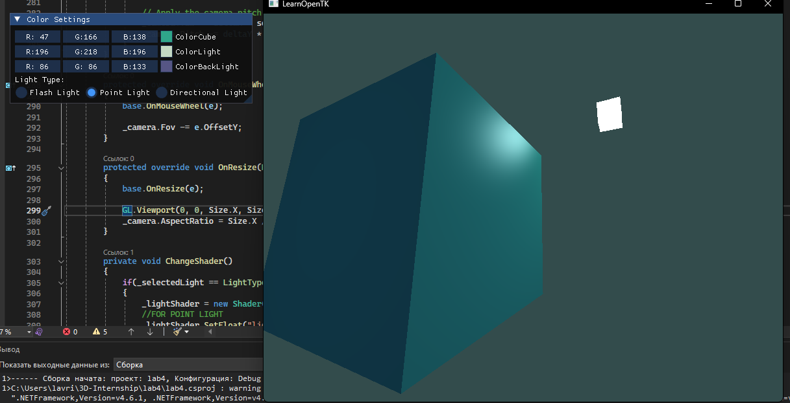
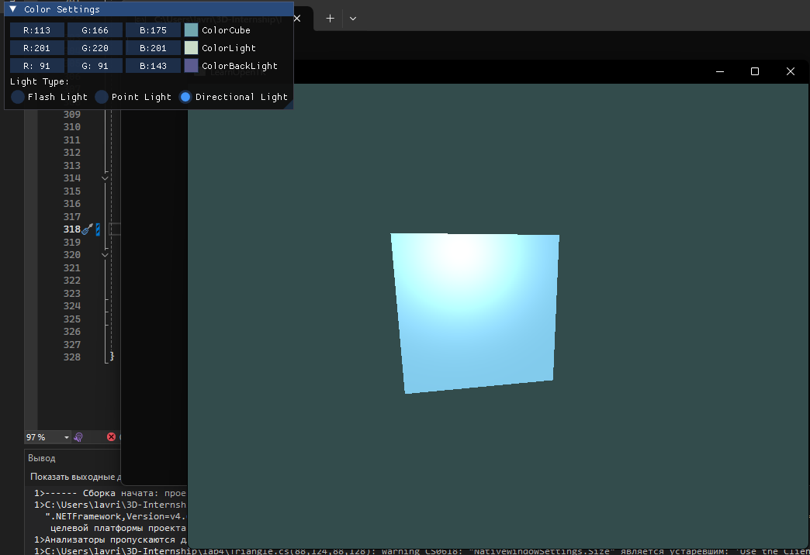
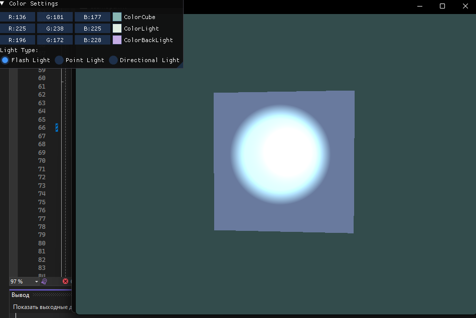
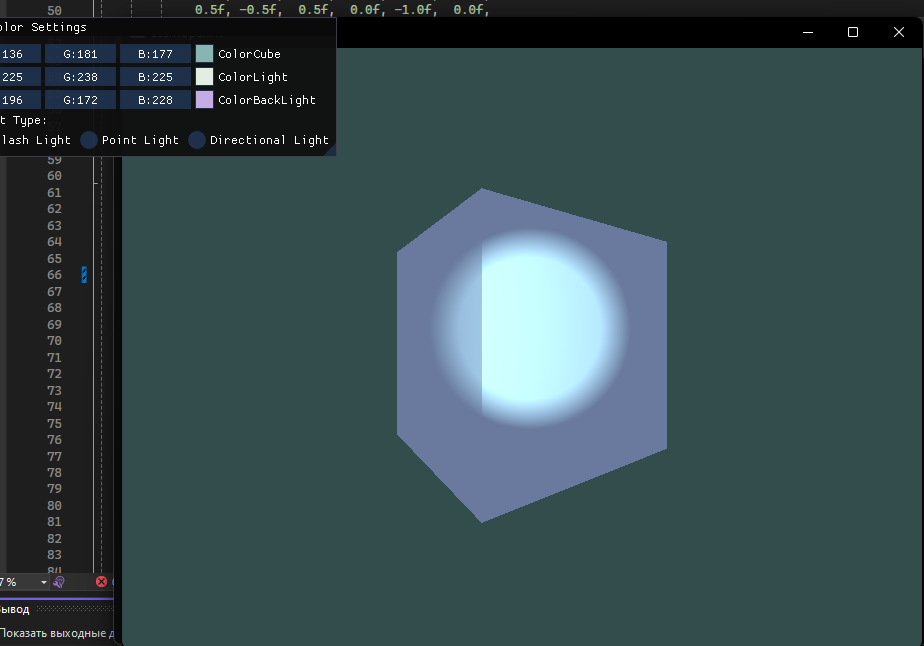

<h1>Lab 4</h1>

Реализовано освещение объекта (кораллового куба). Реализована модель полного отражения Фонга в фрагментном шейдере.

Также реализовано 3 типа освещения: Направленный свет, точечный источник света и фонарик.

<h2>Точечный источник света</h2>

Источник далеко от объекта:

Источник близко к объекту:

<h2>Направленный свет</h2>

Направление только по оси Z:

Направление (-0.1, 0.3, -1.0):

png.png)

<h2>Фонарик:</h2>

